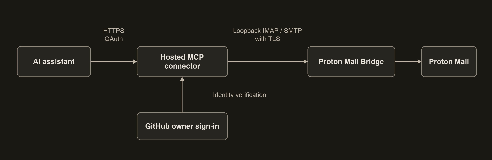

# Proton Mail Connector

A self-hosted MCP connector that gives an AI assistant access to the owner's
actual Proton Mail account through the official Proton Mail Bridge.

Built as part of an independent systems practice: keep mail in Proton, run the
connection on infrastructure you control, and make assistant actions explicit.
The hosted design is intended to work without leaving a personal computer on.
This is an independent project, not an official Proton product.

## What it does

Ten tools support folder listing, bounded message search, reading messages and
attachments, creating drafts, preparing and sending plain-text email, moving
messages, setting read/star flags, and checking the connection.

Sending uses an exact preview and a short-lived, single-use token. The assistant
is instructed to send only on explicit user authorization. A durable ledger
prevents reuse and does not automatically retry an uncertain delivery.

## How it works



The connector runs on a Linux server behind Caddy. Bridge and the connector use
separate Unix accounts. Mail ports stay on loopback; the public endpoint requires
OAuth. GitHub checks the owner's identity without requesting email or repository
scopes. Both authorization hops use S256 PKCE, and refresh tokens rotate.

The server can decrypt mail through Bridge, and content retrieved by the assistant
is shared with that assistant service. This is not a claim of end-to-end encryption
through the AI provider.

## Status and limits

- Hosted deployment is running; live checks verified folder listing, inbox search,
  and creating, reading, and moving a private test draft to Trash.
- ChatGPT account linking and discovery of all ten tools were verified on desktop.
- A mobile approval-session fix was deployed on September 22, 2026. A successful
  ordinary mobile chat test is not yet recorded in this project.
- Eight automated tests cover message bounds, mutation safety, send replay,
  owner verification, consent/cookie binding, PKCE, token rotation/revocation,
  and MCP protocol discovery. No live sending test has been performed here.

Proton Calendar, forwarding with attachments, replacing existing drafts, thread
aggregation, and direct kDrive transfers are not implemented. This is currently
an owner-specific implementation, not a general multi-user service or a turnkey
installer. Some deployment and issuer settings remain specific to the original
installation.

## Development

Requires Node 24 or newer.

```sh
npm ci
npm run check
npm test
npm run build
```

`src/server.ts` provides the stdio MCP entry point; `src/http.ts` provides the hosted
HTTP/OAuth endpoint. Both use the same mail service and tool definitions.

See [deployment documentation](deploy/README.md) for configuration and operational
boundaries. The `scripts/` helpers target the owner's existing deployment; adapt
them before use elsewhere. Credentials and runtime databases belong outside Git.

The `.codex-plugin/` manifest and `.app.json` describe the owner's registered
ChatGPT connector. Publishing this source does not grant access to that mailbox
or install the connector for another account.

The project logo is in [assets](assets/proton-mail-connector-logo.png).
